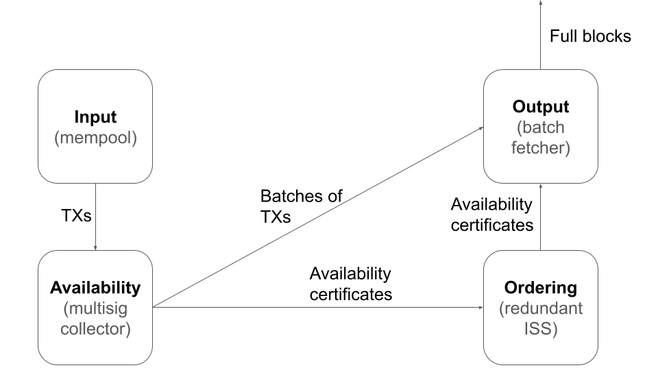
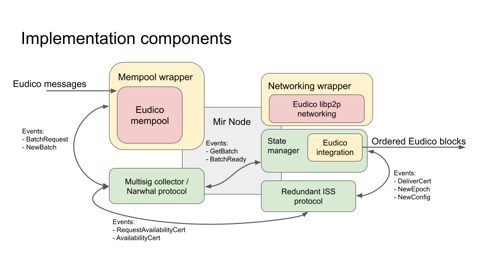

# Trantor: Modular Consensus for (not only) Filecoin IPC

This document describes the architecture of Trantor, a modular total-order broadcast (TOB) protocol, and its implementation using the [Mir framework](https://github.com/filecoin-project/mir).

> TODO: Write proper introduction

## The problem

The problem Trantor solves is total-order broadcast (TOB).
Informally, in a system consisting of multiple nodes,
each node receives client transactions and outputs batches of these transactions,
such that the sequence of transaction batches output by each node is the same.

> TODO: properly define the system model and desired properties of the system.

## Trantor implementation

Trantor implements TOB in 4 stages:

1. **Input:** Nodes receive transactions for ordering. We assume the following about transaction reception.
   - Nodes do not necessarily receive transactions in the same order (otherwise we wouldn't need to implement TOB)
   - Not all nodes necessarily receive (as direct input) all transactions at all.
     Trantor must make sure to propagate all transactions to the output of all nodes in such a case.
2. **Availability:** Correct nodes make all received transactions available to all other correct nodes,
   producing succinct availability certificates. Each such certificate references a sequence of transactions.
   Given an availability certificate, a node must be able to retrieve all transactions (including payload) referenced by the certificate.
3. **Ordering:** Correct nodes agree on a unique sequence of availability certificates.
4. **Output:** For each availability certificate in the agreed-upon sequence,
   each correct node outputs a batch of transactions (including payload).

Trantor's high-level architecture is depicted in the figure below.



> **Note on code snippets:** Code snippets in this document are intended
> to improve understanding of the text and should be understood as pseudocode (with syntax similar to Go)
> rather than actual implementation.
> The used data structure fields, their names and types might differ in the actual implementation,
> but will represent the same ideas.
> Some fields used in the implementation might be omitted here for simplicity of presentation.
> Names of concrete events are also subject to change in the actual implementation.

### Starting simple but functional

We first focus on implementing a complete incarnation of Trantor that is fully functional out-of-the-box
with a minimum of restrictions or additional assumptions.
For this incarnation, *simplicity* will be the primary concern when implementing each component of the system,
even it results in significant performance penalties (in terms of both throughput and latency).
Only then we may augment the implementations of the individual components
by more complex and more performant protocol implementations and various optimizations.
The design and choice of protocols allow for incrementally building
more and more advanced protocols mostly by augmenting their simple predecessors,
such that a minimum of written code will have to be abandoned during the process.

Given that all the functionality required from Trantor
(interacting with Lotus, handling transactions, supporting arbitrary node restarts and reconfiguration,
debugging and evaluation tools, etc.) can already be developed
using the first simple incarnation of Trantor,
we will focus on it most of the time, using the simplest available versions of the distributed protocols.
We expect that the effort of swapping in more advanced protocols will be comparatively small,
once the whole system is fully functional.

### Implementation using Mir

The core of the Trantor implementation consists of multiple Mir node `Modules`.
In short, the [Mir library](https://github.com/filecoin-project/mir)
provides an abstraction of a `Node` to which multiple `Modules` can be attached.
`Modules` can trigger events that other `Modules` consume, potentially trigger new events in response, and so on...
A `Module` can as well perform arbitrary actions towards the outside of the node,
potentially in response to the events processed.
The user of the Mir library, in this case the Trantor implementation,
can define arbitrary `Modules` and events they can trigger.
In our case, each of Trantor's components is implemented as a Mir `Module`
(potentially relying on multiple other auxiliary modules).

On a high level, Trantor operates as follows.
1. **Input:** Lotus "messages" (the equivalent of transactions / requests / operations in other systems)
   are inserted in the **mempool** by Lotus itself.
   From Trantor's point of view, those messages (from now on referred to as *transactions*) simply appear there.
   Trantor periodically requests *batches* of those transactions by emitting corresponding events.
   The Mir module consuming those events is a wrapper around the Lotus' mempool.
2. **Availability:** In response to such events, it creates *batches* of transactions
   and submits them (through corresponding events) to the *availability component*.
   The availability component makes sure those batches become available (by replicating them on other nodes)
   and producing corresponding *availability certificates*.
   An availability certificate is a collection of signatures of nodes
   that claim to have received (and persisted) the corresponding batch.
   We thus call our first implementation of the availability component the **multisig collector**.
3. **Ordering:** Those certificates are, in turn, consumed by the *ordering component*
   that emits them in an order that is guaranteed to be the same on all nodes.
   The TOB algorithm we use to order batches is a **redundant** version of the **ISS** protocol
   that foregoes deduplication in favor of better resistance to a mobile adversary.
   > TODO: Insert link to the ISS paper here.
4. **Output:** Finally, the **batch fetcher** module consumes the ordered certificates
   and uses them to construct transaction batches that it outputs.
   To this end, it retrieves transaction batches (with payloads) referenced by each certificate
   from the availability component.
   Note that the availability component might or might not already possess a local copy of the referenced data.
   If it does not, it must execute a fetching protocol to retrieve this data from the nodes that have it.

### Epoch-based operation

Trantor works in *epochs*.
An epoch is a unit of logical time defined by the processing of a certain number of ordered batches.
I.e., each batch belongs to some (single) epoch, which is agreed upon among all nodes.
The advancing from one epoch to the next one is driven by the [ordering component]().
> TODO: Make link work.

During an epoch, the configuration of the whole system always remains unchanged.
We use epoch transitions to update Trantor's configuration (e.g., the set of participating nodes)
We discuss reconfiguration in detail [later](#Re-Configuration).

> Note: The notion of epoch is different from an epoch in Filecoin's expected consensus.
The notion of epoch in Filecoin's expected consensus resembles more that of a sequence number of a batch in our case.

A high-level schema of Trantor's Mir-based implementation is depicted below.
It shows the essential components of the system
(few technical ones, e.g. those for computing hashes and signatures, are omitted for simplicity of presentation).

Lotus' components are shown in red. Trantor accesses those through their API.
Wrappers or "glue code" is shown in yellow. Those components translate Lotus-native API calls and data structures
to ones understood by Trantor and vice versa.
Trantor's native components not directly interfacing with Lotus are green.
Arrows between components (that are all implemented as Mir `Modules`)
represent the exchange of Mir events.
Only modules and events directly related to transaction processing are depicted.
For simplicity of presentation, we omit events and modules related to reconfiguration / epoch-based operation,
technical events like sending / receiving network messages or timer events.

> TODO: Update the image


We now describe the components and their workings in more detail.

### Input (mempool)

When requested to produce a batch, the mempool queries Lotus' mempool and assembles a batch of transactios.
We assume that all necessary checks (e.g., correct format, validity of signatures, etc.) have been performed on them.
The mempool (and Trantor) thus assumes that all transactions received from Lotus' mempool
are valid and ready to be executed (in order of their nonces - see below).

The mempool's operation is simple:
When the availability component requests a transaction batch
(by emitting a `RequestBatch` event that the mempool receives),
the mempool emits a `NewBatch` event containing all transactions
that have been received since emitting the last `NewBatch` Event.

> TODO: Mention resurrection (re-insertion) of transactions that have already been emitted in a `NewBatch` event,
> but failed to go through the ordering protocol and need to be re-proposed.

#### Transaction format, IDs, and Lotus' nonces

Each transaction processed by Trantor is identified by the tuple `(ClientID, TXno)`
(the *transaction identifier*) and contains some transaction `data` as payload.
`ClientID` is an identifier of the entity that produced the transaction (e.g., a user of the system or a Lotus actor).
In our case, the `ClientID` corresponds to a Lotus wallet address.
The transaction number `TXNo` is a monotonically increasing number
that each transaction-producing entity (referred to as *client* from now on) assigns to the transactions it produces.
In our case, the `TXNo` corresponds Lotus' nonce.
I.e., Lotus's messages and nonces are, respectively, transactions and transaction numbers for Trantor.
Trantor distinguishes multiple types of transactions that we discuss in detail [later](#State-manager-operation).
> TODO: Update internal link when section title changes.

The basic format of a transaction is thus as follows.
```go!
type Transaction struct {
    ClientID <lotus_wallet_address_type>
    TXNo     int
    Data     []byte
    Type     <tx_type_enum>
}
```

The client is responsible for producing transactions with monotonically increasing `TXNo`s attached.
If two transactions with different data payloads are produced by the same client with the same `TXNo`,
Trantor does not guarantee processing any of them.
One (not both) of them, however, still might be processed.
In order to refer to a particular transaction, we use a *transaction reference*
that consists of a transaction identifier and the hash of the transaction's `data`.

When creating a batch, the mempool makes sure that
- Transactions from the same client are ordered by increasing transaction numbers (`TXNo`) within the batch and
- For each client, the transaction numbers of the respective transactions
  form a contiguous continuation of the already executed transaction number sequence.
  (E.g., for a single client, if transactions with numbers 0, 1, and 2 have been executed in the past,
  the produced batch might contain transaction numbers (3) or (3 and 4), but not (just 4) or (3 and 5 without 4))
- All transactions are within their respective clients' watermark windows (see [Post-order transaction deduplication]())
> TODO: Fix link.

### Availability (multisig collector)

The *Multisig collector* is a Mir module that implements Trantor's availability component.
On a high level, it periodically executes the following algorithm:
1. Upon request from the ordering component (expressed by a `RequestAvailabilityCert` event),
   obtain a new batch from the mempool.
2. Persistently store the batch.
   > Note: Persistence to disk is not yet implemented and batches are kept only in memory.
3. Send a corresponding batch reference to all other nodes.
   A batch reference only includes references to (hashes of) transactions, not the payloads.
4. Wait until a quorum of other nodes obtain the transaction payloads that they are missing,
   persist them and respond with a signed hash of the batch.
5. Compose a multisig batch certificate of the received signatures.
6. Emit an `AvailabilityCert` event including the certificate as a response to the ordering component,
   which will then include the certificate in a proposal.

Later, when the ordering component delivers the certificate to the batch fetcher,
the batch fetcher requests the corresponding transaction batch from the multisig collector
through appropriate events (that contain the ordered certificate).
Note that, despite being unlikely in the normal case operation,
the multisig collector might not have the batch stored locally.
In such a case, it actively pulls the batch from other nodes specified in the availability certificate.
To prevent flooding the network with redundant responses to a batch request,
the batch fetcher does not immediately ask all nodes listed in the certificate, but chooses only few of them.
Only if they do not respond within a timeout, the batch fetcher tries to pull the data from other nodes.

> Note: The optimized pulling behavior is not implemented yet.

#### Note on transaction payload dissemination with Lotus

The Multisig collector (together with the mempool) are responsible for transaction payload dissemination.
When used in Lotus, its implementation can make use of the mempool Lotus already implements.
Lotus' mempool implementation already gossips transactions, providing a reliable broadcast layer,
but without strong availability guarantees (transactions in the mempool might not survive a node restart).
Trantor's availability component thus only needs to implement the missing guarantees on top of Lotu's existing mempool.

While not optimal in performance
(there might exist more efficient approaches to transaction dissemination than Lotus' mempool gossip),
this approach is simple to implement.
Thanks to Trantor's modular design, the implementations of the mempool and availability components are easy to replace
by a more advanced and more performant implementations, e.g., Narwhal.

#### Note on duplication in transaction dissemination

As noted above, transaction payloads are gossiped by the mempool.
This results in as much payload transmission duplication as the gossip protocol incurs.

The availability component mostly deals with transaction references,
occasionally transmitting a transaction payload in case a node fails to obtain it through gossip.
If a node is waiting for a gossiped transaction payload for too long,
it might request the data directly through the availability component
(this presents a trade-off between throughput and latency, depending on the interpretation of "too long").
Especially when the system is not saturated,
the batches assembled by the multisig collector on each node will have very similar (if not the same) content,
resulting in redundant transmission of transaction references.
Those are, however, significantly smaller than transaction payloads.
Should this form of duplication become a concern,
[deduplication on the level of the availability layer](https://github.com/protocol/ConsensusLab/discussions/93)
will need to be considered.

The actual ordering algorithm is even less concerned by duplication, as it only deals with abvailability certificates,
the size of which is constant in the number of transactions they refer to
(but potentially linear in the number of nodes, unless threshold cryptography is used).

After the availability certificates (possibly referring to duplicate transactions) are ordered,
the system deterministically performs de-duplication on the sequence of delivered transaction references
(see [batch fetcher](#Batch-fetcher)).
> TODO: Check if the link works and fix it if it doesn't.

Note that even if a transaction is referenced by multiple availability certificates,
once a node has received it, the node can use it with all the associated certificates without further retransmission.

The positive effect of such "inexpensive" duplication (of hashes, not payloads) is resistance to censorship.
Since every node's proposal can refer to any transaction,
even an adaptive adversary cannot censor any particular request
without controlling multiple nodes at the same time.

### Ordering (redundant ISS)

Trantor's ordering component uses a redundant flavor of the ISS protocol (rISS)
that foregoes deduplication in favor of a better resistance to a mobile adversary.
In short, in its current instantiation, rISS simply multiplexes multiple finite versions of PBFT.
The "finiteness" of PBFT means that each instance of PBFT only orders a finite number of inputs
before being disposed of and replaced by a new instance in a new epoch.

Whenever the ordering component is ready to order a new input
(the current initial implementation uses a periodic timeout),
it emits a `RequestAvailabilityCert` event that is consumed by the availability component.
The availability component responds with an `AvailabilityCert` event
containing an availability certificate that contains a transaction batch.
After executing the total-order broadcast protocol for the certificate,
the ordering component emits a `DeliverCert` event to be consumed by the output component.

Moreover, the ordering component drives the advancing from one epoch to the next (see [Epochs and configurations]())
and triggers the checkpointing protocol (executed by a separate component, see [Checkpointing]()).
For simplicity of presentation, we postpone the describing the details.
> TODO: Fix links.

#### Heartbeat

Even in complete absence of load, i.e., when no transactions at all are being submitted by the client,
the ordering component still periodically emits `RequestAvailabilityCert` events
and the availability component certifies the availability of empty batches.
In other words, if there are transactions in the mempool, the batches produced by rISS will contain them.
If there are none, empty batches will still be produced at some (low) minimal rate.
This allows the system to constantly make progress and transition between epochs,
which is required for [reconfiguration]().
> TODO: Fix link.

#### Resurrecting of failed proposals

> TODO: Mention resurrection of failed proposals.

### Output (batch fetcher)

The stream of events produced by the ordering component is intercepted and transformed by the batch fetcher.
The batch fetcher's main task is to replace all availability certificates in this event stream
by full transaction batches.
We refer to batches output by the batch fetcher and the contained transactions
respectively as delivered batches and transactions.

Concretely, for each availability certificate (contained in a `DeliverCert` event),
the batch fetcher retrieves the associated transaction batch with payloads from the availability component.
To this end, the batch fetcher emits a `GetBatch` event to the availability component,
waits for a response in form of a `BatchReady` event
and replaces the corresponding `DeliverCert` event by a `NewOrderedBatch` event.

The stream of ordered events output by the ordering component also contains other events
related to checkpointing and epoch transitions (not described so far).
The batch fetcher only observes those events, takes the appropriate action (e.g. updating its configuration accordingly)
and relays those events to the output without modification.
We provide more details in the sections on [checkpointing](), [epochs and configurations]().
> TODO: Fix links.

#### Post-order transaction deduplication

It might happen that a single transaction is referred to by multiple ordered availability certificate.
The batch fetcher makes sure that only the first output batch contains this transaction
by removing it from all subsequent delivered batches.
To this end, the batch fetcher keeps a record of all delivered transactions
and only includes a transaction in a batch if it has not been previously delivered.

Implemented naively, this approach would make the batch fetcher's memory footprint grow indefinitely.
However, we exploit the fact that each client is assumed to number its transactions
with contiguous, monotonically increasing transaction numbers (`TXNo`).
Furthermore, we allow each client to concurrently submit only a limited number of transactions.
I.e., if $txn$ is the highest transaction number delivered by client $c$,
then we assume $c$ to only submit transactions with `TXNo` $\leq txn + W$,
where $W$ is a configurable parameter that we call *client watermark window*.
The input compoennt (mempool) enforces such behavior by ignoring all $c$'s transactions with higher numbers.
The memory footprint of delivered transaction tracking is thus limited to $O(C \cdot W)$,
where $C$ is the total number of clients.

> Note: The enforcement of client watermark windows is not yet implemented in the mempool.

## System state

This section describes what state Trantor keeps, how it updates this state, how it creates checkpoints
and how it garbage-collects state that is no longer needed.

### State snapshots

The complete state of Trantor is represented in a *state snapshot* as follows

```go
type StateSnapshot struct {
	App   []byte
	Epoch EpochData
}

type EpochData struct {
	Config         EpochConfig
	ClientProgress map[ClientID]DeliveredTXs
}

type EpochConfig struct {
	EpochNr    int
    FirstSN    int
    Length     int
    Membership []NodeInfo
}

type ClientID <lotus_wallet_address_type>

type DeliveredTXs struct {
	lowWM int
}
```

In addition to creating Eudico blocks, the state manager also acts as a proxy for the Eudico state (that we call the *application state*).
It performs state snapshots and restores the application state from snapshots as requested by the rISS component.
> TODO: Write more details on how snapshots work.

The State manager recognizes two different types of transactions:
- *Application transactions (a.k.a. Eudico messages):*
  The content of these transactions is opaque to the State manager
  and it simply forwards those transactions to Eudico for execution by including them in the generated Eudico blocks.
- *Configuration transactions:*
  These transactions are interpreted by the State manager and update its own state (that we call the *configuration state*).
  The configuration state determines the State manager's behavior
  towards the internal components of the ordering layer and their configuration.
  The State manager does not include configuration transactions in the produced Eudico blocks.

The state manager's internal operation is depicted below.
Configuration transactions and related components are in blue
and opaque application (Eudico) transactions and related components are in yellow.
Green components do not distinguish between configuration and application.
The taking and restoring of state snapshots is not depicted for simplicity of presentation.
If it were, however, the corresponding events would also be part of the incoming event stream, just like `NewEpoch`.


### Merit (block reward)

For each output block, the ordering layer needs to assign *merit* values to nodes executing the ordering protocol.
This value reflects how much merit a node has for producing a particular block.
The primary purpose of this mechanism is to allow participants to collect rewards for participating in the ordering protocol.

In classic PoW blockchain systems, this is usually directly linked to minting new coins.
For example, in Bitcoin, it is always a single miner (the one that successfully mined the block) with all the merit for a block.
Similarly, in Filecoin, the signature of a block determines which miner has all the merit for that block.
Our ordering layer, however, must be fit for using a wide variety of ordering protocols,
and thus must not rely on any concrete protocol-specific metadata like block signatures
(Eudico blocks are assembled only after ordering and internal batches might not necessarily even be signed.)

#### Expressing merit

Eudico's ordering layer introduces a general notion of merit that allows the participants to share the merit for a single block.
Each block produced by the block assembler may contain an optional merit data structure
```go
type BlockMerit map[NodeID]uint64
```
assigning integer merit values to node IDs.
A node's relative merit for the block is the fraction of the merit value assigned to it divided by the sum of all merit values for that block.
If no explicit merit is specified, the merit is equally distributed
among all the nodes in the membership of the configuration with which the block is delivered.

<!-- #### Computing merit values

Each transaction in the TX stream has been delivered by the consensus protocol as part of a transaction batch.
Moreover, in BFT-style consensus protocols (as is our case at the moment), each batch has a unique proposer node
(e.g., for PBFT, the node that sent the corresponding Preprepare message).
Thus, each transaction in the TX stream (before de-duplication) can be attributed to a single proposer node.

For each block, each node that is the proposer of at least one transaction in the block is included in the `BlockMerit` structure.
Each node's merit value is the number of transactions for which the node is a proposer.
Note that if multiple nodes propose the same transaction, that transaction will contribute to multiple node's merit values.
 -->

### Garbage collection

Being an SMR system, the rISS module, in addition to ordering transaction batches, periodically creates stable checkpoints of the state.
The state manager supplies the necessary state to rISS on demand through the Mir node's App interface.
The rISS module is configured such that it produces a checkpoint representing the state exactly "between" two epochs,
i.e., after applying all transactions in batches of one epoch but before applying any transaction of the following epoch.
Such a checkpoint serves as the initial checkpoint of the following epoch.

rISS notifies the State manager whenever the starting checkpoint of an epoch becomes stable.
The State manager then may garbage-collect all its state pertaining to previous epochs, except the checkpoints themselves,
as it is all subsumed by the stable checkpoint.
The stability of the checkpoint means that the checkpoint (or a more recent one) is available to a quorum of nodes
and thus the associated state (or a newer version subsuming it) can always be retrieved.

## (Re-)Configuration

We now describe how the configuration of important parameters of the ordering layer,
especially the set of participating nodes (called Validators in Eudico terminology),
is established and how it changes.
Basic understanding of Eudico's
[hierarchical consensus (HC)](https://research.protocol.ai/publications/hierarchical-consensus-a-horizontal-scaling-framework-for-blockchains/delarocha2022.pdf),
its actors and cross-net messages is necessary for understanding this section.

### Node identity and keys used

Each node (called a validator in Eudico terminology) of a subnet is uniquely identified by a *wallet address*:
the address of the node's corresponding wallet in the parent net. I.e., this wallet address serves as the *node ID* in the subnet.

Each node ID (wallet address) is associated with a *libp2p address* used to send protocol messages to the node.

Each node ID is associated with a *weight* value
expressing how much relative voting power the node has in the subnet.

Since the wallet address is directly derived from a key that the node can use to sign subnet ordering protocol messages, no other public key needs to be associated with the node in the subnet.
However, in order for the node to not have to store the private key associated with the wallet address identifying it,
each node ID is also associated with a *subnet node public key* generated
specifically for the purpose of verifying agreement protocol messages.
The node will use the corresponding private key for signing.
We do not specify any requirements or restrictions on what keys or cryptographic protocols to use for signing and verifying.
Each subnet may define its own standards based on its particular choice of ordering protocol, security, performance, and other requirements.

All of the above is saved in the state of the subnet actor (residing in the parent net's state)
in a configuration data structure (described below).
The format used to represent a node is as follows:
```go
type NodeInfo struct {
    NodeID  <eudico_wallet_address_type>
    NetAddr <libp2p_address_type>
    PubKey  []byte
    Weight  int
}
```
*How* it changes is irrelevant from the subnet's point of view.
The subnet just has to react *when* it changes and adopt the corresponding configuration.

#### Note on initial implementation

In the initial implementation, the subnet node public key (`PubKey`) is not used.
Instead, the key associated with the wallet address (directly derived from it) is used for verifying protocol messages.
Each subnet node uses its wallet private key (used for signing its wallet transactions on the parent chain)
to also sign protocol messages in the subnet.

### Epochs and configurations

From the point of view of the ordering layer,
an *epoch* consists of a *starting checkpoint* and a number of batches delivered by rISS.
(Note that this notion of epoch is different from an epoch of Filecoin expected consensus.)
The starting checkpoint represents the state to which the TX stream constructed from the epoch's batches is applied.
The starting checkpoint of the first epoch corresponds to the initial state defined externally when initializing the system.
The starting checkpoint of all other epochs corresponds to the state resulting from applying all transactions in the TX stream
during previous epochs.

Epochs are delimited by `NewEpoch` events emitted by the ordering protocol
(see depiction of [State manager operation](#State-manager-operation)).
The `NewEpoch` events are ordered with respect to `DeliverCert` events,
such that each delivered certificate can be assigned to a single epoch -
the epoch announced by the last `NewEpoch` event preceding the corresponding `DeliverCert` event.

A *configuration* is a set of values (represented as a data structure)
describing parameters of the system that apply during one epoch.
It contains the set of the nodes participating in the protocols (membership),
their network addresses, and potentially other protocol-specific configuration parameters.

```go
type Configuration struct {
    Membership []NodeInfo

    //... potentially more fields
}
```

The starting checkpoint (concretely the configuration state included in it) of an epoch contains the epoch's configuration.
If necesary for seamless epoch transitions,
the system can be set up such that the starting checkpoint of the n-th epoch determines the configuration for the (n+k)th epoch
(while the starting checkpoint of the first epoch defines configurations for the first k epochs).

At the start of an epoch (i.e. on reception of the `NewEpoch` event),
the State manager has processed all the availability certificates of the previous epoch
(since those were preceding the `NewEpoch` event in the incoming event stream).
Thus, the configuration state corresponds to the starting checkpoint of the new epoch.
At this point, the State manager performs the necessary actions for initializing the new epoch
(e.g. opening connections to newly joined nodes, informing the appropriate modules about the new configuration, etc.).
Note that, depending on the value of k, the new epoch can be the one just starting (k = 0), or a future epoch (k > 0).
In the case of k > 0, the configuration of the starting epoch has already been established in the past.

### HC subnet (re)configuration

In the hierarchical consensus architecture implemented in Eudico,
we adopt (at least for now) a top-down approach to subnet configuration.
This means that the configuration of a subnet (including its membership, also referred to as "validator set")
is determined by the state of the corresponding subnet actor (SA) of the parent.
A bottom-up approach, where the subnet itself decides to reconfigure and only announces that decision to the parent
(as described in [Pikachu RFP: Checkpointing Filecoin onto Bitcoin](/5WMtXbE4Qr-w_pd-kjI1qw)),
is not considered for now, as the nature of the HC implementation is currently better suited for the top-down approach.

#### Reconfiguration mechanism

Among potentially other values, the SA's state contains a list of node (validator) identities,
where each node identity is associated with information that:
- Allows to send messages to the node (usually a network address - libp2p, ip, ...)
- Allows to verify signatures produced by the node (usually a public key)
- Determines the "weight" of the node in the underlying subnet consensus protocol (e.g. the amount of collateral the node submitted at the level of the parent chain).

This information (potentially together with other values) constitutes a *configuration* introduced above.
It is determined purely by the parent net and the task of the subnet is to reconfigure itself accordingly.
This is done as follows:

1. Communicating configuration information from parent to subnet

   As required by the hierarchical consensus architecture,
   each node (validator) in the subnet maintains a copy of its parent's state.
   Analogously to cross-net messages, changes in the SA state (parent chain) trigger *config messages*
   that are automatically inserted by Eudico in the mempool (subnet chain) of every node in the subnet
   and carry information about the new subnet configuration.
   Moreover, each node attaches its signature to the config message before inserting it in its mempool.
   Note that each correct subnet node will eventually submit such a signed config transaction.
   Thus, for n nodes executing the subnet protocol, there will be n distinct config messages (differing only in their signatures)
   in the nodes' respective mempools.

2. Agreement on new subnet configuration

   Within the subnet, config messages (viewed as config transactions by the ordering layer)
   pass through the ordering protocol as any other transaction would,
   until the batch they are included in is retrieved by the State manager from the availability layer.
   At this point, config transactions are intercepted by the State manager (and not included in a Eudico block).
   When the state manager collects a quorum of matching and correctly signed config transactions,
   it considers the new configuration to be agreed upon.

   Note that it might seem unnecessary to perform another round of "voting" on the config transactions on top of the subnet chain,
   when each subnet node can independently verify the correctness of the config transaction
   "simply" by observing it in its local copy of the parent state.
   However, this approach appears to be much more complicated in practice,
   as it would require the availability component of the ordering protocol to have a special execution path for config transactions.
   Since we expect the ordering overhead of config transactions to be comparably very small,
   we prefer the nodes using the ordering protocol as a black box for ordering configuration transactions
   and implementing reconfiguration on top of it.

3. Transitioning to a new configuration

   Let $e$ be the epoch in which a new configuration is considered valid by the subnet validators.
   The new configuration takes effect starting from epoch $e+k$
   (for some parameter $k$, that might be hard-coded or even part of the configuration itself).
   The only restriction on $k$ is that $e+k$ must be greater than the starting epoch of any previous configuration.
   The new configuration taking effect means that all nodes (validators) described by it
   start executing the agreement protocol.
   To this end, the state manager instantiates all the relevant components and initializes them using the relevant configuration
   (as described in [Epochs and configurations](#Epochs-and-configurations)).

   For a node to start executing the agreement protocol at epoch $e+k$,
   it must first obtain the starting checkpoint (state snapshot) of the epoch.
   If the node was itself member of the previous configuration, it uses the locally produced checkpoint.
   Otherwise, it contacts (one or more) node(s) from the previous configuration to request the necessary data.
   In the latter case, the newly joining node must be initialized with information about the previous configuration
   (or, potentially, directly with the checkpoint if available).

   Upon obtaining the starting checkpoint, each subnet node in the new configuration confirms to all nodes in the old configuration
   (via a signed message) that it obtained the checkpoint.
   A correct node that is part of the old configuration but not the new one only shuts down when it received such confirmations
   from a quorum of nodes from the new configuration that is sufficiently large to ensure the checkpoint's availability.
   Alternatively, a stable checkpoint from a future epoch can also serve as proof that a node might shut down.
   Note that availability certificates from old epochs might not be valid in new epochs any more.
   Thus, before a node shuts down (or stops executing the availability protocol for a certain epoch), it must make sure that
   all delivered batches relying on the availability protocol of that epoch have been included in a stable checkpoint.
